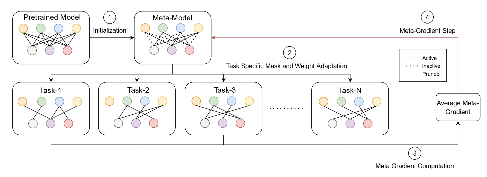

# MetaDOCK

This is the official repository to the CVPR 2022 paper "[Dynamic Kernel Selection for Improved Generalization and Memory Efficiency in Meta-learning]()" This repo is based on the training code in [iMAML](https://github.com/aravindr93/imaml_dev).

<div align=center>

</div>

## Getting Started

You will need [Python 3.8](https://www.python.org/downloads) and the packages specified in _requirements.txt_.
We recommend setting up a [virtual environment with pip](https://packaging.python.org/guides/installing-using-pip-and-virtual-environments/)
and installing the packages there.

Install packages with:

```
$ pip install -r requirements.txt
```
## Configure and Run

All configurations concerning data, model, training, etc. can be called using commandline arguments.

### Training
The implicit_maml script offers many options to train implicit-MAML on 4-conv model family and cifar-fs/miniimagenet dataset.

Here is a sample script to train on cifar-fs dataset, 4-conv model.
```

```

### Training
The implicit_maml_pruner script offers many options to prune the pre-trained model at different budgets.

Here is a sample script to prune on cifar-fs dataset, 4-conv model.
```

```

## Citation
Please cite our paper in your publications if it helps your research.

    @inproceedings{chavan2022metadock,
      title={Dynamic Kernel Selection for Improved Generalization and Memory Efficiency in Meta-learning},
      author={Chavan, Arnav and Tiwari, Rishabh and Bamba, Udbhav and Gupta, Deepak},
      journal={Proceedings of the IEEE Conference on Computer Vision and Pattern Recognition (CVPR)},
      year={2022}
    }
    


## License

This project is licensed under the MIT License.